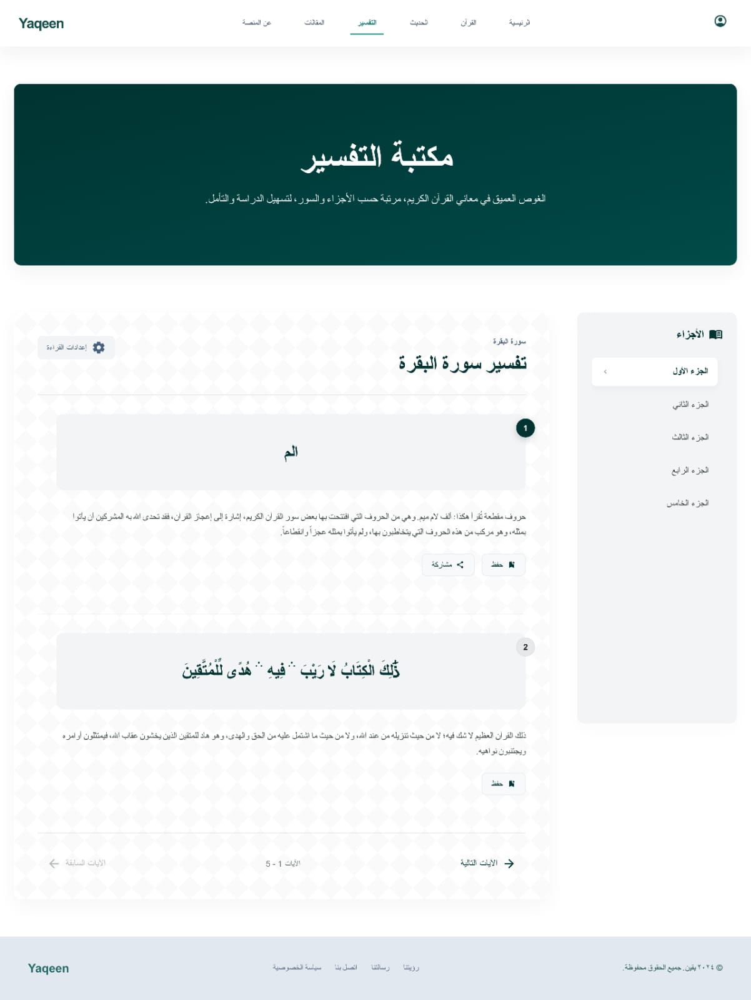
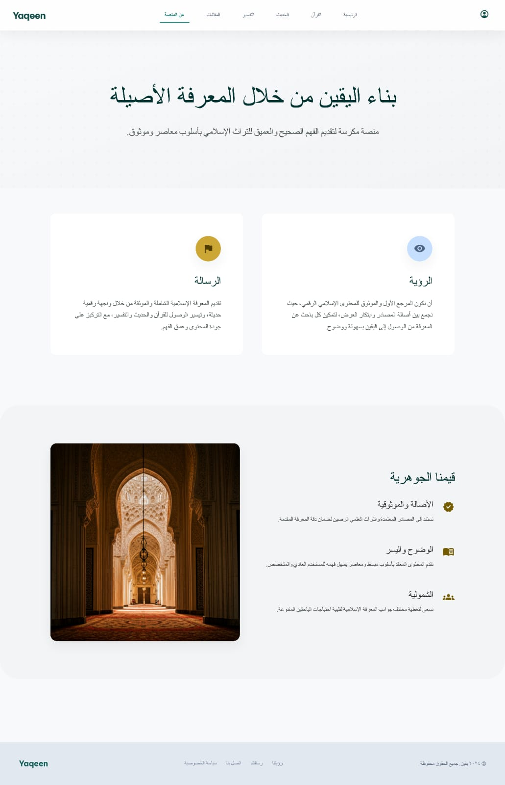
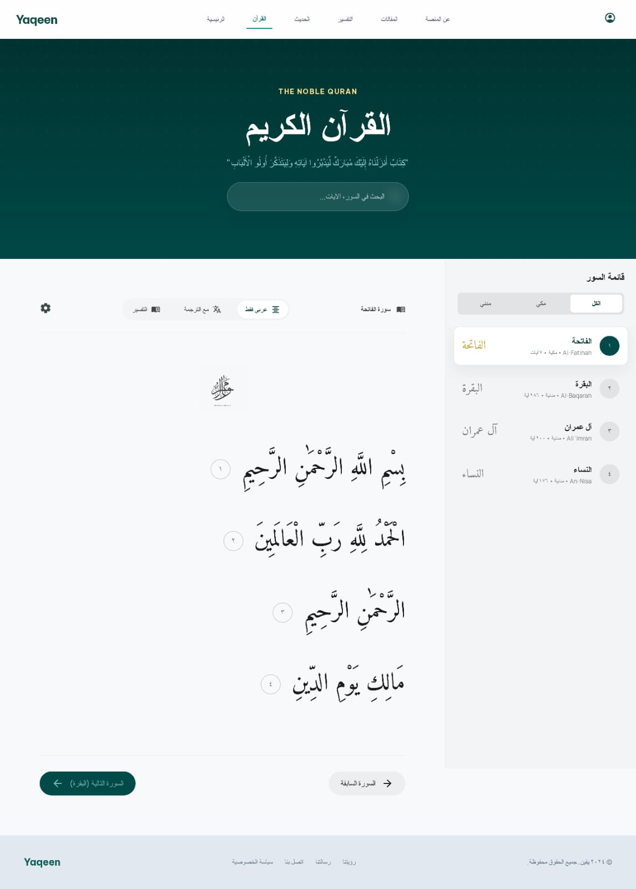
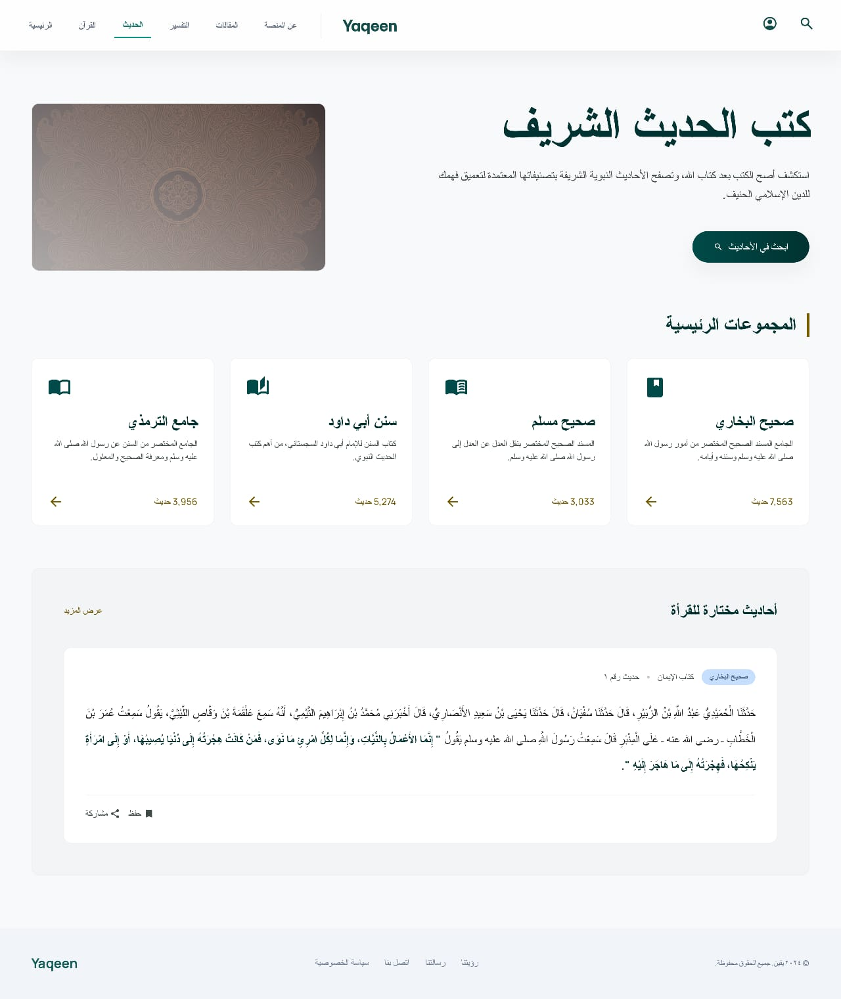
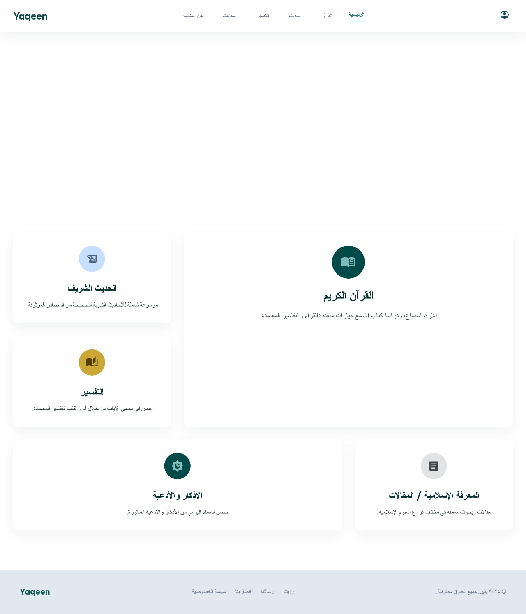
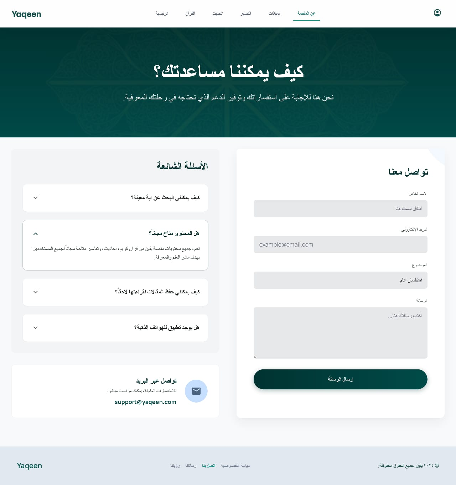

# Yaqeen

<div align="center">


**A Modern Islamic Digital Platform for Quranic Studies, Hadith Learning, and Spiritual Growth**

[](https://opensource.org/licenses/MIT)
[](https://nextjs.org/)
[](https://react.dev/)
[](https://tailwindcss.com/)

[Features](#features) • [Tech Stack](#tech-stack) • [Getting Started](#getting-started) • [Documentation](#documentation) • [Contributing](#contributing)

</div>

---

## 📖 About Yaqeen

Yaqeen is a comprehensive Islamic digital platform designed to make Quranic studies and Islamic education accessible to everyone. Whether you're a beginner exploring the Quran for the first time or a scholar deepening your understanding, Yaqeen provides intuitive tools and authoritative resources.

Our mission is to bridge the gap between ancient Islamic wisdom and modern technology, creating an engaging and educational experience for all users seeking spiritual growth and knowledge.

## ✨ Features

### 🕌 Quranic Studies
- **Complete Quran Database** - Full text of the Quran with Arabic and multiple translations
- **Detailed Interpretations (Tafsir)** - Comprehensive tafsir for each verse with scholarly insights
- **Advanced Search** - Find specific verses, topics, and themes across the entire Quran
- **Bookmark & Annotations** - Save favorite verses and add personal notes

### 📚 Hadith Collection
- **Authentic Hadith Database** - Curated collections from established hadith sources
- **Scholarly Explanations** - Contextual meanings and practical applications
- **Classification System** - Organized by topics and themes for easy discovery
- **Authenticity Ratings** - Clear indicators of hadith authenticity levels

### 🎓 Educational Tools
- **Learning Paths** - Structured courses for different knowledge levels
- **Interactive Quizzes** - Test your understanding with engaging assessments
- **Study Groups** - Connect with fellow learners and discuss Islamic knowledge
- **Daily Reminders** - Motivational Islamic content delivered to your device

### 🌙 Spiritual Resources
- **Prayer Times** - Accurate prayer schedules based on your location
- **Islamic Calendar** - Track important Islamic holidays and dates
- **Duas & Supplications** - Comprehensive collection of authentic dua's
- **Meditation Guides** - Guided reflection sessions for spiritual mindfulness

## 🛠 Tech Stack

| Category | Technology |
|----------|-------------|
| **Frontend Framework** | [Next.js 16.2.4](https://nextjs.org/) |
| **UI Library** | [React 19.2.4](https://react.dev/) |
| **Styling** | [Tailwind CSS 4](https://tailwindcss.com/) |
| **Linting** | [ESLint 9](https://eslint.org/) |
| **Package Manager** | npm / yarn / pnpm / bun |
| **Deployment** | [Vercel](https://vercel.com/) (Recommended) |

## 📁 Project Structure

```
yaqeen/
├── app/                    # Next.js App Router (main application)
│   ├── layout.js          # Root layout wrapper
│   ├── page.js            # Home page
│   └── globals.css        # Global styles
├── design/                # UI/UX Design Files & Mockups
│   └── [wireframes & mockups]
├── public/                # Static assets
│   └── imgs/              # Images and logo
├── eslint.config.mjs      # ESLint configuration
├── jsconfig.json          # JavaScript configuration
├── next.config.mjs        # Next.js configuration
├── postcss.config.mjs     # PostCSS configuration
├── package.json           # Project dependencies
├── LICENSE                # MIT License
├── README.md              # This file
├── CONTRIBUTING.md        # Contribution guidelines
├── CODE_OF_CONDUCT.md     # Community guidelines
└── SECURITY.md            # Security policy
```

## 🚀 Getting Started

### Prerequisites

- **Node.js** 18.17 or later
- **npm** / **yarn** / **pnpm** / **bun** (any package manager)
- **Git** for version control

### Installation

1. **Clone the repository**
   ```bash
   git clone https://github.com/yourusername/yaqeen.git
   cd yaqeen
   ```

2. **Install dependencies**
   ```bash
   npm install
   # or
   yarn install
   # or
   pnpm install
   # or
   bun install
   ```

3. **Set up environment variables** (if needed)
   ```bash
   cp .env.example .env.local
   # Edit .env.local with your configuration
   ```

### Development

Start the development server:

```bash
npm run dev
```

Open your browser and navigate to [http://localhost:3000](http://localhost:3000) to see your changes in real-time. The application will automatically refresh as you modify files.

### Building for Production

```bash
npm run build
npm run start
```

The `build` command optimizes your application for production deployment.

### Linting

Check and fix code quality issues:

```bash
npm run lint
```

## 📖 Usage Guide

### For Users

1. **Explore the Quran** - Start with the Quranic Studies section to browse surahs and verses
2. **Read Tafsir** - Click on any verse to view detailed interpretations
3. **Search Features** - Use the search bar to find specific verses or topics
4. **Save & Annotate** - Bookmark important verses and add personal notes for future reference
5. **Learn Hadith** - Browse authentic hadith collections organized by topic

### For Developers

See the [CONTRIBUTING.md](CONTRIBUTING.md) file for detailed development guidelines, including:
- Setting up your development environment
- Project structure conventions
- Git workflow and branching strategy
- Submitting pull requests

##  Screenshots

> Add screenshots here showcasing key features:
> - Quranic interface with tafsir
> - Hadith collection view
> - Search and filter functionality
> - User profile and bookmarks
> - Educational tools interface
> - Prayer times feature

*Screenshots coming soon - see the [Design](design/) folder for mockups and wireframes*

## UI Design









## 🤝 Contributing

We welcome contributions from the community! Whether you're fixing bugs, adding features, or improving documentation, your help makes Yaqeen better.

### Quick Start for Contributors

1. Read [CONTRIBUTING.md](CONTRIBUTING.md) for detailed guidelines
2. Fork the repository
3. Create a feature branch (`git checkout -b feature/amazing-feature`)
4. Commit your changes (`git commit -m 'Add amazing feature'`)
5. Push to the branch (`git push origin feature/amazing-feature`)
6. Open a Pull Request

### Ways to Contribute

- 🐛 **Report Bugs** - Found an issue? [Open a bug report](https://github.com/yourusername/yaqeen/issues)
- ✨ **Suggest Features** - Have an idea? [Share it with us](https://github.com/yourusername/yaqeen/discussions)
- 📝 **Improve Documentation** - Help us write better docs
- 🌍 **Add Translations** - Help localize Yaqeen to more languages
- 🧪 **Write Tests** - Improve code coverage and reliability

Please read our [CODE_OF_CONDUCT.md](CODE_OF_CONDUCT.md) before participating in our community.

## 🔐 Security

If you discover a security vulnerability, please email us at security@yaqeen.dev instead of using the issue tracker. See [SECURITY.md](SECURITY.md) for more details.

## 📄 License

This project is licensed under the MIT License - see the [LICENSE](LICENSE) file for details.

MIT License (c) 2026 - Yaqeen Contributors

## 🌐 Deployment

### Deploy on Vercel (Recommended)

The easiest way to deploy Yaqeen is using [Vercel](https://vercel.com), the platform created by the Next.js team:

1. Push your code to GitHub
2. Go to [Vercel Dashboard](https://vercel.com/dashboard)
3. Create a new project from your repository
4. Configure environment variables if needed
5. Click Deploy

[Learn more about deploying Next.js on Vercel](https://nextjs.org/docs/app/building-your-application/deploying)

### Other Deployment Options

- **Docker** - Containerize and deploy anywhere
- **Traditional Servers** - Deploy to your own infrastructure
- **Other Platforms** - AWS, Google Cloud, Azure, DigitalOcean, etc.

## 📞 Support & Contact

- **Issues & Bugs** - [GitHub Issues](https://github.com/yourusername/yaqeen/issues)
- **Discussions** - [GitHub Discussions](https://github.com/yourusername/yaqeen/discussions)
- **Email** - support@yaqeen.dev
- **Documentation** - [Full Documentation](#) (coming soon)

## 🙏 Acknowledgments

- Islamic scholars and researchers who provide authentic content
- The Next.js and React communities
- All contributors who help improve Yaqeen
- Our users for their feedback and support

---

<div align="center">

**Made with ❤️ for the global Islamic community**

[⬆ Back to top](#yaqeen)

</div>
